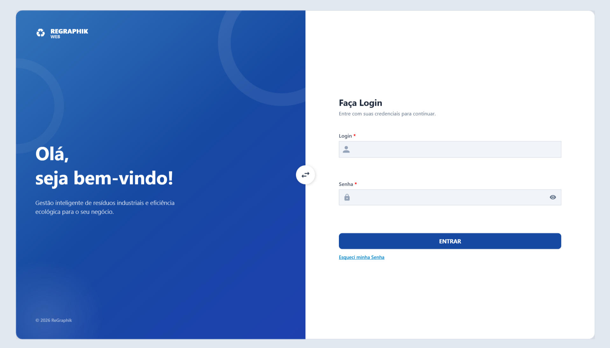

**REGRAPHIK**

**MANUAL DO USUARIO**

## 1 Apresentação

O ReGraphik é um sistema de gestão de estoque reverso criado para apoiar empresas do setor gráfico no controle de resíduos como papel, cartão, vinil, lona e PVC. A solução permite organizar materiais gerados, acompanhar seu status, identificar possibilidades de reaproveitamento e localizar pontos de coleta quando o resíduo não puder ser reutilizado internamente.

## 1.2 Objetivo do sistema

- Centralizar o cadastro dos resíduos gerados pela empresa.

- Reduzir o uso de planilhas e controles manuais dispersos.

- Acompanhar os estados Em Estoque, Reaproveitado e Descartado.

- Apoiar decisões de reaproveitamento e destinação.

- Disponibilizar indicadores, relatórios e localização de pontos de coleta.

- Promover rastreabilidade e melhor aproveitamento dos materiais.

Figura 2 — Fluxo operacional planejado para os usuários do ReGraphik.

## 1.3 Perfis de acesso

| **Perfil**     | **Permissões principais**                                                                                                          |
|----------------|------------------------------------------------------------------------------------------------------------------------------------|
| Usuário comum  | Realizar login, cadastrar resíduos, consultar estoque reverso, aplicar sugestões, consultar mapa e gerar relatórios habilitados.   |
| Administrador  | Executar as funções do usuário e gerenciar usuários, tipos de materiais, permissões e exclusões restritas com auditoria.           |
| Equipe técnica | Instalar, configurar, atualizar, diagnosticar falhas e validar integrações. Não deve usar credenciais de usuários sem autorização. |

## 1.4 Primeiro acesso

**1.** Na tela inicial, selecione a opção de cadastro ou pré-cadastro, quando disponível.

**2.** Informe os dados solicitados. O sistema realiza validações como CPF e formato de campos.

**3.** Aguarde o token numérico de 6 dígitos enviado por e-mail.

**4.** Digite o token para ativar o pré-cadastro.

**5.** Finalize o cadastro com os dados e a senha solicitados.

**6.** Retorne à tela de login e acesse com usuário/login e senha.

<table>
<colgroup>
<col style="width: 100%" />
</colgroup>
<thead>
<tr class="header">
<th>
<strong>Segurança</strong>

A senha não deve ser compartilhada. O projeto determina armazenamento por hash, nunca em texto claro. O usuário deve encerrar a sessão ao utilizar computador compartilhado.
</th>
</tr>
</thead>
<tbody>
</tbody>
</table>

## 1.5 Login

**1.** Abra o ReGraphik.

**2.** Informe o login e a senha cadastrados.

**3.** Selecione o comando de entrar/acessar.

**4.** Aguarde a validação junto à API.

**5.** Em caso de falha, verifique os dados digitados, a internet e se o cadastro foi ativado.

## 1.6 Tela inicial e navegação

A aplicação foi modelada com uma janela principal e páginas para Dashboard, Resíduos, Estoque Reverso, Mapa e Relatórios. O usuário deve utilizar o menu lateral ou principal para alternar entre os módulos disponíveis. A ordem e os nomes visuais precisam ser confirmados na versão final instalada.

| **Menu/Módulo**      | **Finalidade**                                                                           |
|----------------------|------------------------------------------------------------------------------------------|
| Dashboard            | Exibir indicadores e resumo do estoque reverso.                                          |
| Cadastro de Resíduos | Registrar e consultar materiais gerados.                                                 |
| Estoque Reverso      | Acompanhar resíduos por status e possíveis destinações.                                  |
| Sugestões            | Consultar e aplicar formas de reaproveitamento.                                          |
| Mapa                 | Buscar pontos de coleta por cidade.                                                      |
| Relatórios           | Consolidar dados e gerar saída em PDF/impressão.                                         |
| Configurações/Perfil | Atualizar informações locais, incluindo foto de perfil, quando habilitado.               |
| Chat                 | Comunicação entre usuários, somente se o recurso estiver habilitado na versão instalada. |

## 1.7 Cadastro de resíduos

**1.** Acesse o módulo Cadastro de Resíduos.

**2.** Selecione a opção para adicionar um novo registro.

**3.** Informe o tipo de material e os demais dados exigidos, como origem, quantidade, dimensões e estado físico, conforme a tela final.

**4.** Anexe fotografias quando necessário. Os formatos documentados são JPG, JPEG, PNG e BMP.

**5.** Revise os dados e confirme o cadastro.

**6.** Verifique se o item aparece na lista ou no estoque reverso com o status inicial previsto.

## 1.8 Estoque reverso e status

O estoque reverso concentra os resíduos cadastrados. A documentação da solução prevê visualização em cards e diferenciação por status. Os estados são:

- **Em Estoque —** material cadastrado e aguardando decisão.

- **Reaproveitado —** material destinado a uma forma de reutilização.

- **Descartado —** material encaminhado para descarte ou coleta adequada.

Para alterar o status, selecione o resíduo, escolha a ação permitida e confirme. Operações de exclusão devem permanecer restritas ao Administrador e gerar registro de auditoria.

## 1.9 Sugestões de reaproveitamento

**1.** Abra o resíduo desejado ou o módulo de Sugestões.

**2.** Consulte as recomendações filtradas pelo tipo de material.

**3.** Analise a aplicação sugerida e sua adequação ao resíduo.

**4.** Selecione a opção de aplicar a sugestão.

**5.** Confirme a operação. O sistema deve registrar a relação e a data de aplicação.

## 1.10 Mapa e pontos de coleta

**1.** Acesse o menu Mapa.

**2.** Informe a cidade desejada no campo de busca.

**3.** Selecione Buscar.

**4.** Aguarde a consulta à API e a renderização do mapa.

**5.** Analise os pontos retornados e selecione o local adequado.

**6.** Caso nenhum ponto seja exibido, confirme internet, cidade informada e disponibilidade do serviço.

<table>
<colgroup>
<col style="width: 100%" />
</colgroup>
<thead>
<tr class="header">
<th>
<strong>Uso de dados externos</strong>

Os pontos de coleta dependem de serviços externos e podem variar. Antes de encaminhar resíduos, confirme endereço, horário e tipo de material aceito diretamente com o estabelecimento.
</th>
</tr>
</thead>
<tbody>
</tbody>
</table>

## 1.11 Dashboard e relatórios

Quando habilitados, os indicadores previstos incluem total de resíduos, peso total, quantidade reaproveitada e valor econômico. A geração do relatório deve consolidar os registros e permitir impressão ou exportação em PDF.

**1.** Acesse Dashboard ou Relatórios.

**2.** Selecione os filtros de período, status ou material, caso estejam disponíveis.

**3.** Confira os totais e os registros exibidos.

**4.** Selecione Gerar, Imprimir ou Exportar PDF, conforme a interface.

**5.** Escolha o local de salvamento e confirme se o arquivo abre corretamente.

## 1.12 Configurações e foto de perfil

A solução registra a foto de perfil, alteração de senha.
