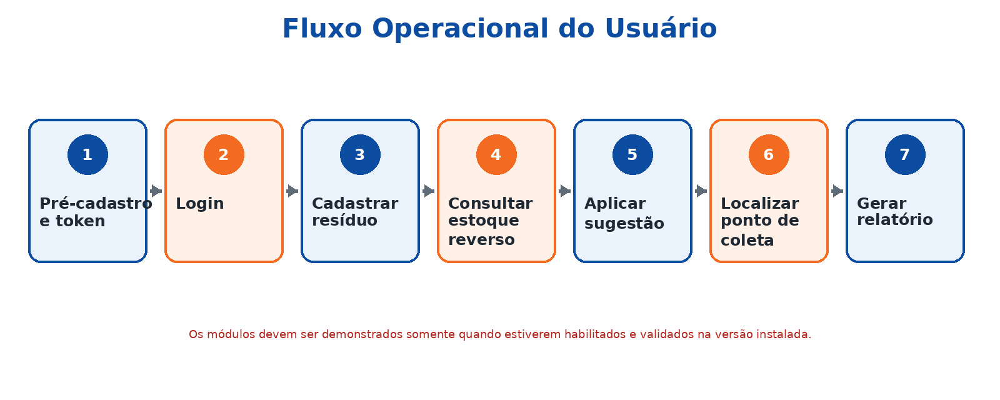
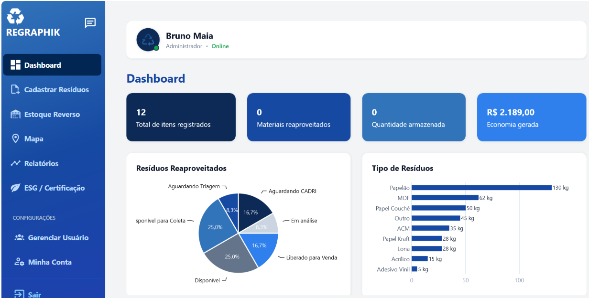
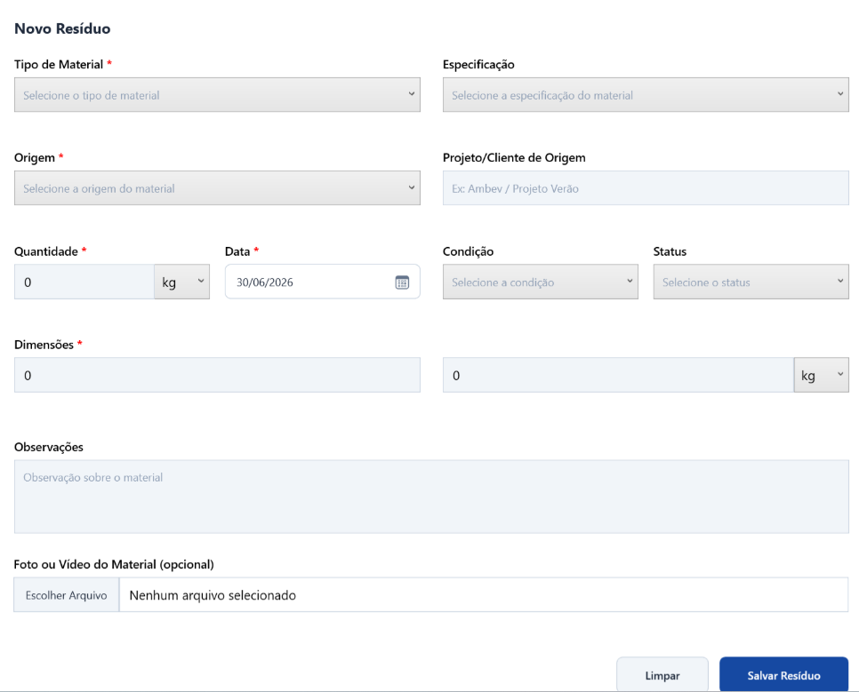
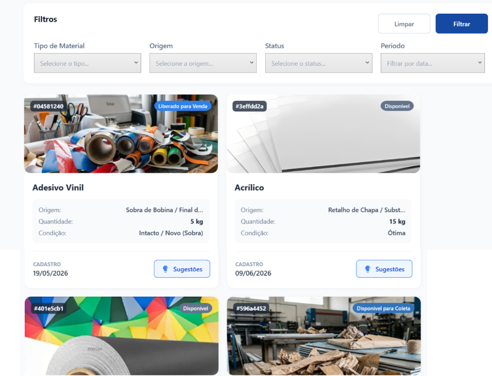
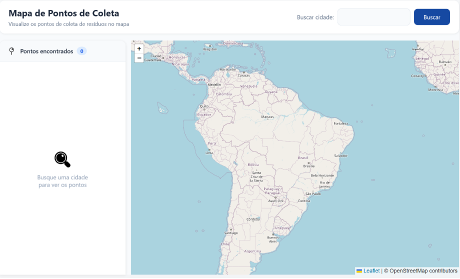
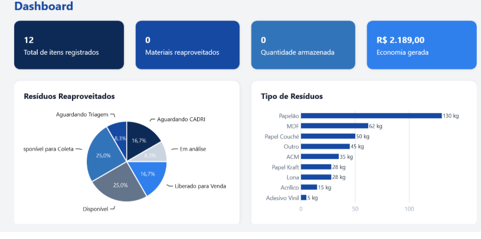
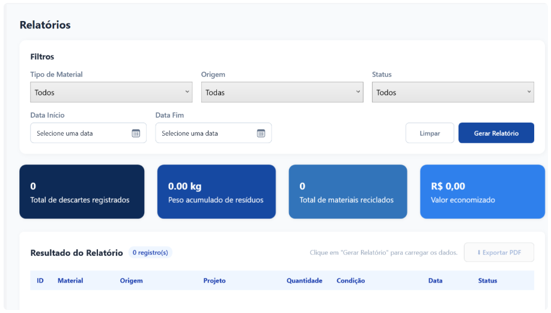
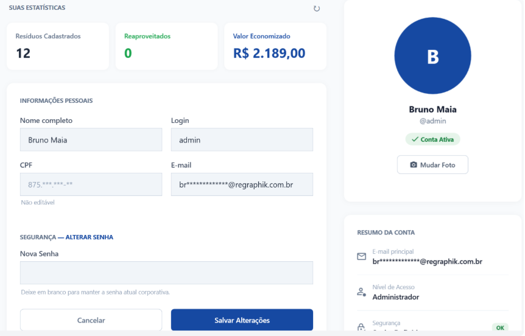

# Manual de Usuário — ReGraphik

## 1. Apresentação

O **ReGraphik** é um sistema de gestão de estoque reverso projetado para apoiar empresas do setor gráfico no controle e destinação sustentável de resíduos (como papel, cartão, vinil, lona e PVC). 

A solução centraliza o mapeamento de materiais gerados, acompanha seus ciclos de vida, sugere possibilidades de reaproveitamento e localiza pontos de coleta homologados quando o resíduo não puder ser reutilizado internamente.

---

### 1.1 Objetivo do Sistema

* **Centralizar o cadastro** de resíduos gerados na operação gráfica.
* **Eliminar a dependência** de planilhas e controles manuais descentralizados.
* **Monitorar o ciclo de vida** através dos status: `Em Estoque`, `Reaproveitado` e `Descartado`.
* **Apoiar a tomada de decisão** para reaproveitamento interno e destinação ecologicamente correta.
* **Disponibilizar indicadores** por meio de dashboards, relatórios consolidados e mapa interativo de pontos de coleta.
* **Garantir rastreabilidade** e maximizar o aproveitamento de insumos.

 

  
   
  <em>Figura 1 — Fluxo operacional planejado para os usuários do ReGraphik.</em>

---

### 1.2 Perfis de Acesso

| Perfil | Permissões Principais |
| :--- | :--- |
| **Usuário Comum** | Autenticação, cadastro de resíduos, consulta ao estoque reverso, aplicação de sugestões de reuso, consulta ao mapa e geração de relatórios operacionais. |
| **Administrador** | Todas as funções do Usuário Comum, além da gestão de usuários, parametrização de tipos de materiais, gerenciamento de permissões e exclusões restritas acompanhadas de auditoria. |
| **Equipe Técnica** | Instalação, parametrização de ambiente, atualizações, diagnóstico de falhas e validação de integrações/APIs. *(Uso de credenciais de terceiros é estritamente vedado).* |

---

### 1.3 Primeiro Acesso e Cadastro

1. Na tela inicial da aplicação, selecione a opção **Cadastrar-se** ou **Pré-cadastro**.
2. Preencha os campos obrigatórios. O sistema executará validações automáticas de formato (ex: CPF/CNPJ e e-mail).
3. Verifique a caixa de entrada do e-mail informado para obter o **token de verificação de 6 dígitos**.
4. Insira o token na tela de validação para ativar o pré-cadastro.
5. Complete o formulário com os dados complementares e defina sua senha de acesso.
6. Retorne à tela inicial e realize o login.

> **Nota de Segurança:**  
> As senhas são protegidas por algoritmos de *hash* criptográfico e nunca armazenadas em texto claro. Não compartilhe suas credenciais. Ao utilizar computadores compartilhados, sempre encerre a sessão (*Logout*) ao finalizar suas atividades.

---

## 2. Autenticação e Navegação

### 2.1 Login

  
   
  <em>Figura 2 — Tela de autenticação no sistema.</em>

1. Inicie a aplicação **ReGraphik**.
2. Informe o **Login/E-mail** e a **Senha** cadastrados.
3. Clique no botão **Entrar**.
4. Aguarde a validação de credenciais junto à API.
5. *Em caso de falhas de autenticação:* certifique-se de que os dados foram digitados corretamente, valide a conexão de rede e confirme se a conta foi devidamente ativada via token.

---

### 2.2 Tela Inicial e Módulos do Sistema

  
   
  <em>Figura 3 — Visão geral da interface do ReGraphik.</em>

A interface do ReGraphik é organizada em uma janela principal com navegação simplificada por menu lateral:

| Módulo / Menu | Finalidade Operacional |
| :--- | :--- |
| **Dashboard** | Exibe indicadores consolidados (KPIs) e resumos gráficos do estoque reverso. |
| **Cadastro de Resíduos** | Permite registrar, detalhar e consultar novos materiais gerados. |
| **Estoque Reverso** | Acompanhamento analítico de resíduos categorizados por status e destinação. |
| **Sugestões** | Consulta e aplicação de técnicas recomendadas de reutilização de materiais. |
| **Mapa** | Localização geográfica de pontos de coleta e reciclagem filtrados por município. |
| **Relatórios** | Consolidação de dados operacionais com opções de impressão e exportação em PDF. |
| **Configurações / Perfil** | Gestão de dados do usuário local, alteração de credenciais e foto de perfil. |
| **Chat** | Canal de comunicação interna entre usuários *(disponível mediante habilitação na versão)*. |

---

## 3. Operação do Sistema

### 3.1 Cadastro de Resíduos

  
   
  <em>Figura 4 — Formulário de registro de resíduos.</em>

1. Acesse o menu **Cadastro de Resíduos**.
2. Clique no botão **Novo Registro** (`+`).
3. Preencha as propriedades do material: tipo de insumo, origem, quantidade, dimensões e estado físico.
4. Anexe evidências fotográficas do resíduo (Formatos suportados: `.jpg`, `.jpeg`, `.png`, `.bmp`).
5. Revise as informações e confirme a operação.
6. Verifique se o item foi incorporado à listagem do **Estoque Reverso** com o status inicial previsto.

---

### 3.2 Gestão de Estoque Reverso e Status

O módulo de Estoque Reverso apresenta os resíduos cadastrados organizados em *cards* visuais. O ciclo de vida do resíduo é controlado pelos seguintes estados:

* **Em Estoque:** Material cadastrado, mensurado e aguardando definição de destinação.
* **Reaproveitado:** Material direcionado com sucesso para um processo interno de reuso.
* **Descartado:** Material encaminhado para descarte consciente ou coleta externa homologada.

> **Restrição de Acesso:**  
> A exclusão definitiva de registros é uma atribuição exclusiva do perfil **Administrador** e gera registros rastreáveis no log de auditoria do sistema.

---

### 3.3 Sugestões de Reaproveitamento

  
   
  <em>Figura 5 — Interface de sugestões técnicas de reuso.</em>

1. Selecione um item no **Estoque Reverso** ou navegue até o menu **Sugestões**.
2. Visualize as recomendações de reuso filtradas automaticamente conforme o tipo de insumo.
3. Avalie a viabilidade técnica da aplicação sugerida para o resíduo selecionado.
4. Clique em **Aplicar Sugestão**.
5. Confirme a ação. O sistema atualizará o histórico do resíduo vinculando a técnica utilizada e a data de aplicação.

---

### 3.4 Localização de Pontos de Coleta (Mapa)

  
   
  <em>Figura 6 — Busca de pontos de coleta por município.</em>

1. Acesse o menu **Mapa**.
2. Informe o município desejado no campo de pesquisa.
3. Clique no botão **Buscar**.
4. Aguarde a renderização dos marcadores geográficos fornecidos pela API.
5. Selecione um ponto no mapa para visualizar detalhes do estabelecimento parceiro.

> **Uso de Dados Externos:**  
> A exibição dos pontos de coleta depende de serviços de geolocalização externos. Antes de realizar o deslocamento ou envio de resíduos, confirme os horários de funcionamento e tipos de materiais aceitos diretamente com a instituição de coleta.

---

### 3.5 Dashboard e Emissão de Relatórios

  
   
  <em>Figura 7 — Visão geral de indicadores do Dashboard.</em>

  
   
  <em>Figura 8 — Módulo de relatórios operacionais.</em>

O painel de indicadores apresenta métricas em tempo real, incluindo: volume total de resíduos, peso acumulado (kg), taxa de reaproveitamento (%) e estimativa de valor econômico recuperado.

1. Navegue até o módulo **Dashboard** ou **Relatórios**.
2. Aplique os filtros desejados (ex: período, tipo de material ou status).
3. Confira os dados consolidados apresentados em tela.
4. Clique em **Gerar PDF** ou **Imprimir**.
5. Defina o diretório de destino em seu computador e salve o documento.

---

## 4. Configurações e Perfil do Usuário

  
   
  <em>Figura 9 — Gerenciamento de perfil e credenciais.</em>

No menu **Configurações / Perfil**, o usuário poderá:
* Atualizar dados cadastrais básicos.
* Alterar sua senha de acesso periodicamente.
* Upload ou atualização da foto de exibição do perfil.

---

  <em>© ReGraphik — Gestão Inteligente de Estoque Reverso Gráfico. Todos os direitos reservados.</em>

