# Plano de Teste - ReGraphik

---

## 1. Identificação do Projeto

| Item | Detalhes |
| :--- | :--- |
| **Nome do Sistema** | **ReGraphik** — Plataforma de Gestão de Estoque Reverso |
| **Versão** | `1.0.0`|
| **Equipe Responsável** | Bruno Maia, Otávio Henrique, Lucas Aquino, Luna Beatriz, Kaio Alves |
| **Unidade SENAI** | SENAI Afonso Greco – Nova Lima |
| **Instrutor Orientador**| Frederico Martins Aguiar |
| **Data do Planejamento**| 10/08/2026 |
| **Ambientes** | **API REST:** `webregraphik.runasp.net` / **Desktop:** WPF .NET 8 / **BD:** Firebase Realtime DB |

---

## 2. Objetivos dos Testes

O objetivo deste Plano de Testes é validar a estabilidade, integridade, usabilidade e conformidade técnica do ecossistema **ReGraphik** (Cliente Desktop WPF + API REST ASP.NET Core) antes da implantação final nas indústrias do setor gráfico.

* **O que a equipe pretende verificar?**
  * Sincronização e persistência em tempo real dos dados de resíduos e conversas no **Firebase Realtime Database**.
  * Consumo seguro e síncrono da **API REST** (`webregraphik.runasp.net`) pelo cliente **Desktop WPF**.
  * Precisão dos algoritmos de recomendação da **Economia Circular** e dos cálculos do **Módulo ESG**.
  * Comportamento e fluidez de integrações externas (**Google Maps Places API**, **Imgur API** para fotos de perfil).
  * Geração e formatação correta dos relatórios exportados em **PDF via QuestPDF**.
  * Instalação e execução através dos instaladores gerados (**WiX Toolset `.msi`** e **Inno Setup `.exe`**).

* **Quais riscos pretende reduzir?**
  * Perda ou corrupção de registros de estoque reverso no banco de dados em nuvem.
  * Incompatibilidade/Falha de carregamento no componente `WebView2` (Mapa Leaflet.js).
  * Exceções não tratadas (*crashes*) na interface desktop ao lidar com indisponibilidade de conexão/API.
  * Lentidão no carregamento dos indicadores da **Dashboard** (gráficos OxyPlot) ou estouro de cota do Firebase.

* **O que será considerado evidência de qualidade?**
  * Aprovação de 100% dos Casos de Teste críticos e de alta prioridade.
  * Ausência de bugs de severidade Alta ou Crítica abertos na release.
  * Logs de execução sem exceções não capturadas (`Unhandled Exceptions`).
  * Relatórios de auditoria e certidões ESG gerados com dados 100% consistentes.

---

## 3. Escopo

### 3.1 O que será testado (In-Scope)
* **Módulos Funcionais do Cliente WPF:**
  * **Autenticação em 2 Etapas:** Login, Recuperação de Senha e validação de Token de Convite.
  * **Dashboard:** Carregamento de métricas financeiras, histórico e gráficos com OxyPlot.
  * **Cadastrar Resíduos:** Validação de entradas (dimensões, tipo, quantidade, origem) e upload de imagem.
  * **Estoque Reverso:** Filtragem com `ICollectionView` por tipo, status e período.
  * **Mapa / Pontos de Coleta:** Integração Google Maps Places API e exibição no Leaflet via WebView2.
  * **Sugestão de Resíduos:** Algoritmo de cruzamento e associação de reaproveitamento.
  * **Chat em Tempo Real:** Envio/recebimento de mensagens direto via Firebase Realtime DB.
  * **Relatórios e ESG:** Geração de estatísticas e exportação em PDF via QuestPDF.
  * **Minha Conta / Perfil:** Alteração de dados e upload de foto via Imgur API.
* **API REST (`ApiRestReGraphik`):**
  * Endpoints de CRUD, validação de requisições JSON e respostas HTTP adequadas (`200`, `201`, `400`, `401`, `404`, `500`).
* **Instalação e Empacotamento:**
  * Instalação limpa, criação de atalhos e desinstalação via pacote `.msi` / `.exe`.

### 3.2 O que NÃO será testado (Out-of-Scope)
* Testes de carga extrema / estresse superiores a 1.000 requisições simultâneas por segundo na API.
* Compatibilidade com sistemas operacionais antigos (Windows 7/8) ou plataformas não-Windows (macOS/Linux).
* Validação interna da infraestrutura dos servidores do Firebase ou Google.

### 3.3 Funcionalidades Prioritárias
1. Autenticação e Controle de Acesso (Token e Perfis).
2. Cadastro, Alteração e Atualização de Status do Resíduo.
3. Comunicação síncrona Cliente WPF $\leftrightarrow$ API REST $\leftrightarrow$ Firebase.
4. Geração do Relatório ESG em PDF.
5. Funcionamento do Mapa de Pontos de Coleta.

---

## 4. Base de Teste

Artefatos e especificações técnicas utilizados para desenhar e executar os cenários de teste:
* **Especificação da API REST / Swagger (OpenAPI):** Disponível em `https://webregraphik.runasp.net.`.
* **Documentação Mintlify do Projeto:** Publicada em `https://brunomaia.mintlify.app/`.
* **Modelagem de Dados:** Diagramas Conceitual, Lógico e Físico do sistema (Firebase / API / WPF).
* **Diagramas da UML:** Casos de Uso, Diagramas de Fluxo, Diagramas de Sequência e Mapa de Bounded Contexts.
* **Regras de Negócio do Setor Gráfico:** Tolerâncias de dimensões (cm/m), status do resíduo (`Disponível`, `Reservado`, `Descartado`) e equivalências de descarte ecológico.

---

## 5. Abordagem de Testes

* **Testes Funcionais:** Validação ponta a ponta se as regras do negócio gráfico estão sendo atendidas.
* **Testes de Integração:** 
  * Integração WPF $\leftrightarrow$ API REST (via HTTP/JSON).
  * Integração WPF $\leftrightarrow$ Firebase Realtime Database (Chat em tempo real).
  * Integração API REST $\leftrightarrow$ Google Maps Places API.
  * Integração WPF $\leftrightarrow$ Imgur API (Upload de imagens).
* **Testes de Sistema:** Verificação de fluxos completos (ex: Cadastrar resíduo $\rightarrow$ Consultar no Estoque Reverso $\rightarrow$ Aplicar Sugestão $\rightarrow$ Alterar Status $\rightarrow$ Gerar Relatório ESG).
* **Testes Não-Funcionais:** 
  * Desempenho e resposta da interface gráfica em WPF durante o carregamento de dados.
  * Usabilidade em diferentes resoluções de tela desktop (HD e Full HD).
* **Testes Exploratórios:** Sessões livres focadas em cenários de uso não previstos ou ações inesperadas do usuário.
* **Reteste e Regressão:** Reexecução de cenários após correções de código para garantir estabilidade contínua.

---

## 6. Técnicas de Projeto de Testes

| Técnica | Aplicação no ReGraphik |
| :--- | :--- |
| **Particionamento de Equivalência** | Validação de formatos em campos como E-mail, CPF, CEP e URLs de imagem. |
| **Análise de Valor Limite (AVL)** | Aplicada em dimensões em cm/m ($0$, valores negativos, casas decimais), quantidades de resíduo ($0$, $1$, $999999$) e limites de caracteres de texto no Chat. |
| **Tabela de Decisão** | Regras de alteração de Status do Resíduo (`Disponível` $\rightarrow$ `Reservado` $\rightarrow$ `Descartado`) baseadas no perfil do usuário (Administrador vs. Operador). |
| **Testes Baseados em Cenários** | Simulação do fluxo de trabalho diário de um operador de gráfica registrando aparas de papel e buscando reciclagem. |
| **Testes de Aceitação:** | Aplicável nas entregas para o instrutor orientador e stakeholders do SENAI, validando se o sistema atende aos critérios definidos nos Casos de Uso e histórias de usuário do TCC (ex: operador consegue cadastrar, buscar e reciclar um resíduo do início ao fim). |
| **Testes Baseados em Cenários:** | Simulação de fluxos reais de uso do dia a dia de uma gráfica (ex: operador cadastra apara de papel → sistema sugere reaproveitamento → chat combina retirada → status muda para Reservado → relatório ESG reflete a movimentação).|
| **Testes Exploratórios** | Sessões livres guiadas por checklist mínimo, focadas em interações inesperadas na tela de Cadastro de Resíduos e no comportamento do WebView2 sob perda de conexão. |

---

## 7. Casos de Teste

### 7.1. Autenticação, Cadastro de Usuários e Segurança

| ID | Funcionalidade | Cenário / Condição | Entrada | Resultado Esperado | Resultado Obtido | Evidência do Teste | Status |
| :--- | :--- | :--- | :--- | :--- | :--- | :--- | :--- |
| **CT001** | Login | Autenticação com credenciais válidas | Login: `[E-mail Válido]`<br>Senha: `[Senha Válida]` | Acesso liberado, Token de sessão salvo no Firebase Auth e redirecionamento para a Dashboard. | Login foi realizado para adentrar no sistema ReGraphik e tela principal de DashBoard carregada. | [Evidência CT001](#detalhamento-ct001) | ✅ Concluído |
| **CT002** | Login | Tentativa de login com senha incorreta | Login: `[E-mail Válido]`<br>Senha: `[Senha Incorreta]` | Mensagem de erro *"Usuário ou senha inválidos"* e acesso bloqueado. | — | — | ⏳ Pendente |
| **CT003** | Cadastro / Convite | Registro de novo usuário com Token de Convite Válido | E-mail: `[E-mail Válido]`<br>Token: `[Token Válido]` | Conta ativada com sucesso no Firebase e permissão concedida. | — | — | ⏳ Pendente |
| **CT004** | Cadastro / Convite | Registro de novo usuário com Token Inválido/Expirado | E-mail: `[E-mail Válido]`<br>Token: `[Token Inválido]` | Mensagem de erro *"Token de convite inválido ou já utilizado"* e bloqueio do cadastro. | Ao inserir um token inválido, o sistema não retornou a mensagem de erro. Após a correção da causa raiz, a mensagem passou a ser exibida corretamente. | [Evidência CT004](#detalhamento-ct004) | ✅ Concluído |
| **CT005** | Perfil do Usuário | Upload e alteração de foto de perfil via Imgur API | Selecionar imagem `avatar.png` (PNG < 2MB) | Upload concluído, URL gerada no Imgur v5 e atualizada na interface WPF. | — | — | ⏳ Pendente |

---

#### Detalhamento de Execução dos Testes (Grupo 7.1)

<a id="detalhamento-ct001"></a>
#### CT001 - Login com Credenciais Válidas

1. **Funcionalidade:** CT001 - Login
2. **Cenário / Condição:** Autenticação com credenciais válidas.
3. **Entrada:** Login: `[E-mail Válido]`, Senha: `[Senha Válida]`
4. **Resultado Esperado:** Acesso liberado, Token JWT/Firebase gerado e redirecionamento para a Dashboard.
5. **Resultado Obtido:** Login foi realizado para adentrar no sistema ReGraphik e tela principal de DashBoard carregada.


6. **Evidência do Teste:** Foi avaliado e homologado conforme evidenciado no resultado obtido, o cliente realiza o login, adicionando login e senha válidos, e é direcionado para a tela da Dashboard.
7. **Status:** ✅ Concluído

---

<a id="detalhamento-ct004"></a>
#### CT004 - Registro de Novo Usuário com Token Inválido/Expirado

1. **Funcionalidade:** CT004 - Cadastro / Convite
2. **Cenário / Condição:** Registro de novo usuário com Token Inválido ou Expirado
3. **Entrada:** E-mail: `[E-mail Válido]`, Token: `[Token Inválido]`
4. **Resultado Esperado:** Mensagem de erro *"Token de convite inválido ou já utilizado"* e bloqueio do cadastro.
5. **Resultado Obtido:** Cadastro do usuário realizado e token válido enviado com sucesso!


Ao inserir um token inválido no credenciamento do usuário, o sistema não retornou uma mensagem de “Token de convite inválido ou já utilizado”.

6. **Evidência do Teste:** Foi identificada a causa raiz do problema, que era a falta de uma mensagem de erro do token, para identificar que o token está inválido.


Após a correção, a rotina foi replicada novamente e a mensagem foi exibida corretamente.


7. **Status:** ✅ Concluído

---

### 7.2. Gestão do Estoque Reverso e Resíduos

| ID | Funcionalidade | Cenário / Condição | Entrada | Resultado Esperado | Resultado Obtido | Evidência do Teste | Status |
| :--- | :--- | :--- | :--- | :--- | :--- | :--- | :--- |
| **CT006** | Cadastro de Resíduo | Inclusão de aparas de papel com dados válidos | Tipo: `Papel A4`<br>Qtd: `50`<br>Dimensões: `21x29.7cm` | Resíduo salvo no Firebase com status `Disponível` e atualização imediata do estoque. | — | — | ⏳ Pendente |
| **CT007** | Cadastro de Resíduo | Tentativa de cadastro com quantidade zerada ou negativa | Tipo: `Vinil`<br>Qtd: `-5` | Validação de formulário impedindo envio: *"A quantidade deve ser maior que zero"*. | — | — | ⏳ Pendente |
| **CT008** | Cadastro de Resíduo | Omissão de campos obrigatórios no cadastro | Tipo: `Em Branco`<br>Qtd: `10` | Indicação em vermelho nos campos nulos com mensagem *"Preencha os campos obrigatórios"*. | — | — | ⏳ Pendente |
| **CT009** | Consulta de Estoque | Filtragem dinâmica por tipo de resíduo | Filtro em memória: `Vinil` | A listagem atualiza via `ICollectionView` exibindo apenas os resíduos do tipo Vinil sem travamentos. | — | — | ⏳ Pendente |
| **CT010** | Alteração de Status | Transição do estado do resíduo de "Disponível" para "Reservado" | Clicar em *"Reservar Resíduo"* ID `#104` | Status no Firebase alterado para `Reservado`, mudando a cor do indicador no card do app. | — | — | ⏳ Pendente |
| **CT011** | Alteração de Status | Finalização do ciclo de vida para "Descartado/Reaproveitado" | Clicar em *"Dar Baixa / Concluir"* | Resíduo movido para a lista de concluídos e contabilizado na métrica da Dashboard ESG. | — | — | ⏳ Pendente |
| **CT012** | Exclusão de Resíduo | Remoção de item do estoque por perfil Usuário vs Administrador | Perfil: `Usuário` clicando em Excluir | Opção desabilitada ou com mensagem *"Ação restrita a Administradores"*. | — | — | ⏳ Pendente |

---

### 7.3. Módulo de Geolocalização e Pontos de Coleta

| ID | Funcionalidade | Cenário / Condição | Entrada | Resultado Esperado | Resultado Obtido | Evidência do Teste | Status |
| :--- | :--- | :--- | :--- | :--- | :--- | :--- | :--- |
| **CT013** | Pontos de Coleta | Busca de pontos de reciclagem por cidade válida | Cidade: `Nova Lima` | Consulta enviada à Google Places API e marcadores (pins) desenhados no Leaflet/WebView2. | — | — | ⏳ Pendente |
| **CT014** | Pontos de Coleta | Pesquisa por cidade sem retorno ou inexistente | Cidade: `Igarapé` | Retorno limpo e exibição da mensagem *"Nenhum ponto de coleta localizado nesta região"*. | Inicialmente não retornou aviso. Após validação adicionada ao `MapaViewModel`, a mensagem passou a ser exibida corretamente. | [Evidência CT014](#detalhamento-ct014) | ✅ Concluído |
| **CT015** | Interatividade do Mapa | Clique no Pin do Ponto de Coleta | Clicar no marcador no mapa | Janela (popup) é aberta contendo endereço, telefone de contato e tipos de materiais aceitos. | Popup interativo renderizado no WebView2 com sucesso. | Homologado | ✅ Concluído |
| **CT016** | Fallback do Mapa | Execução sem conexão com a internet ou API fora do ar | Desconectar internet / Buscar mapa | Tratamento de exceção exibindo *"Serviço de mapa indisponível. Verifique sua conexão"*. | — | — | ⏳ Pendente |

---

#### Detalhamento de Execução dos Testes (Grupo 7.3)

<a id="detalhamento-ct014"></a>
#### CT014 - Pesquisa por Cidade sem Retorno ou Inexistente

1. **Funcionalidade:** CT015 - Pontos de Coleta / Pesquisa por cidade sem retorno ou inexistente.
2. **Cenário / Condição:** Pesquisar o nome de uma cidade que não possui nenhum ponto de coleta.
3. **Entrada:** Login: `[Usuário Válido]`, Senha: `[Senha Válida]`
4. **Resultado Esperado:** Retorno limpo e exibição da mensagem *"Nenhum ponto de coleta localizado nesta região"*.
5. **Resultado Obtido:** Pesquisei pela cidade de Igarapé e o sistema não retornou nenhum ponto de coleta e nenhuma mensagem de aviso. Pesquisei pontos de coleta na cidade de Igarapé após a correção, e o sistema retornou a mensagem *"Nenhum ponto de coleta localizado nesta região"*.
6. **Evidência do Teste:** Foi adicionada uma validação no `MapaViewModel` para verificar se a busca pela cidade retornou algum ponto de coleta. Quando nenhum resultado é encontrado, o sistema exibe a mensagem *"Nenhum ponto de coleta localizado nesta região"*, sem alterar o funcionamento das demais funcionalidades do mapa.
7. **Status:** ✅ Concluído

---

### 7.4. Comunicação Corporativa (Chat em Tempo Real)

| ID | Funcionalidade | Cenário / Condição | Entrada | Resultado Esperado | Resultado Obtido | Evidência do Teste | Status |
| :--- | :--- | :--- | :--- | :--- | :--- | :--- | :---: |
| **CT017** | **Chat Tempo Real** | Envio de mensagem de texto simples entre dois usuários | Texto: `"Resíduo #104 liberado para coleta."` | Mensagem enviada e renderizada instantaneamente via Firebase Realtime na tela do destinatário. | Objeto `Mensagem` instanciado com remetente, destinatário, texto do resíduo e status `Lida = false` validados com sucesso. |  | ✅ Concluído |
| **CT018** | **Chat Tempo Real** | Tentativa de envio de mensagem vazia | Texto: `""` (vazio/espaços) | O botão de envio permanece inativo ou ignora a ação. | O método `EnviarMensagemAsync` disparou exceção `ArgumentException` ao receber textos vazios ou espaços em branco. |  | ✅ Concluído |
| **CT019** | **Notificação de Chat** | Recebimento de mensagem com a janela do chat minimizada | Envio de mensagem externa | Indicador visual de alerta de "Nova Mensagem" exibido na barra superior da aplicação. | A propriedade `MensagensNaoLidas` foi incrementada de 0 para 1 ao receber nova mensagem com a tela desautorizada/minimizada. |  | ✅ Concluído |
| **CT020** | **Identificador de Sala** | Geração determinística de ID da conversa entre dois usuários | IDs: `"userA"` e `"userB"` | O ID da conversa deve ser sempre idêntico independentemente da ordem em que os usuários iniciam o chat. | A chamada estática ordenou alfabeticamente os IDs gerando `"userA_userB"` tanto para (A, B) quanto para (B, A). | | ✅ Concluído |
| **CT021** | **Marcação de Leitura** | Atualização do status das mensagens recebidas para lido | Lista de mensagens pendentes | Apenas as mensagens enviadas pelo remetente e com status `Lida = false` devem ser filtradas para atualização. | O filtro Linq isolou com precisão a mensagem pendente ignorando mensagens já lidas e mensagens enviadas pelo destinatário. | | ✅ Concluído |
| **CT022** | **Leitura de Usuários** | Desserialização de JSON flexível para lista de usuários | JSON com chaves `name` / `foto_perfil` | O modelo `Usuario` deve ser preenchido corretamente mesmo com variações de nomenclatura no nó do Firebase. | Fallback de propriedades mapeou com êxito `name` para `Nome` e `foto_perfil` para `FotoPerfil`, além de capturar a chave do Firebase. |  | ✅ Concluído |
| **CT023** | **Resiliência de Conexão** | Ocorrência de falha ou perda de conexão no Firebase | Consulta a nó indisponível | O serviço deve tratar a exceção via `try/catch` retornando lista vazia ou valor padrão `0` sem estourar exceção na UI. | Todos os métodos assíncronos de busca (`ObterMensagensAsync`, `ContarNaoLidasAsync`, `ListarUsuariosAsync`) trataram o erro retornando coleções vazias. |  | ✅ Concluído |
| **CT024** | **Resiliência de Conexão** | Contagem de mensagens não lidas com erro de rede ou Firebase | Parâmetros: `"destinatario"`, `"remetente"` | O serviço deve tratar a exceção e retornar o valor padrão `0` sem interromper a execução do app. | O método `ContarNaoLidasAsync` capturou a falha no bloco `catch` e retornou `0` como valor de fallback seguro. |  | ✅ Concluído |

---

### 7.5. Indicadores, Dashboard e Relatórios ESG

| ID | Funcionalidade | Cenário / Condição | Entrada | Resultado Esperado | Resultado Obtido | Evidência do Teste | Status |
| :--- | :--- | :--- | :--- | :--- | :--- | :--- | :---: |
| **CT025** | **Dashboard / Perfil** | Formatação de perfil e geração de iniciais do usuário | Nome: `"Carlos Eduardo"`, Perfil: `"Admin"` | Exibir nome completo, iniciais `"CE"` e o perfil expandido como `"Administrador"`. | A View Model atribuiu corretamente o nome, calculou as iniciais `"CE"` e converteu `"Admin"` para `"Administrador"`. |  | ✅ Concluído |
| **CT026** | **Dashboard / Usuário** | Cálculo do fallback de iniciais para variações de nome | Nomes variados (`"João Silva"`, `"Maria"`, `""`, `null`) | Gerar iniciais com base nas palavras do nome ou retornar `"?"` em caso de valor inválido. | O cálculo retornou `"JS"`, `"M"` e fallback `"?"` em todos os casos de teste estipulados. |  | ✅ Concluído |
| **CT027** | **Dashboard / Avatar** | Validação do caminho do arquivo local da foto de perfil | Caminho: `@"C:\caminho_inexistente_foto.png"` | Retornar `null` caso a foto de perfil não seja uma URL e o arquivo local não exista no disco. | A propriedade `FotoPerfil` validou a inexistência do arquivo no disco via `File.Exists` e retornou `null` com segurança. |  | ✅ Concluído |
| **CT028** | **Dashboard / Gráficos** | Formatação de valores do eixo Y no gráfico de barras | Entrada numérico: `150.5` | Formatar o peso exibindo duas casas decimais seguidas do sufixo `"kg"`. | A função `FormatterTipos` formatou o valor numérico para o padrão textual `"150,50 kg"`. |  | ✅ Concluído |
| **CT029** | **Dashboard / Indicadores** | Agregação de contadores e valor total estimado de resíduos | Lista de resíduos com quantidades e status variados | Calcular o total de resíduos, contagens por status (`"Reaproveitado"`, `"Em Estoque"`) e multiplicar a quantidade por R$ 5,50. | Os contadores totais foram consolidados e a expressão LINQ `Sum` calculou com precisão o valor monetário acumulado. |  | ✅ Concluído |
| **CT030** | **Dashboard / Listagem** | Filtragem dos 5 últimos resíduos com reindexação de ID | Coleção com 10 resíduos cadastrados em datas distintas | Selecionar os 5 mais recentes por data e reindexar seus IDs visualmente de `1` a `5`. | A ordenação decrescente por `DataCadastro` isolou os 5 registros mais recentes e aplicou IDs sequenciais de `1` a `5`. |  | ✅ Concluído |
| **CT031** | **Dashboard / Gráfico Pizza** | Mapeamento dinâmico de cores por status do resíduo | Status do resíduo: `"Disponível"`, `"Reservado"`, etc. | Atribuir a cor RGB correspondente ao status da fatia do gráfico de pizza. | A instrução `switch` mapeou com exatidão as cores de cada status, aplicando a paleta padrão para valores não cadastrados. |  | ✅ Concluído |
| **CT032** | **Dashboard / Gráfico Barras** | Agrupamento de peso por tipo de resíduo | Resíduos duplicados por tipo (ex: 2x `"Plástico"`) | Somar a quantidade total agrupando por tipo e ordenar o resultado de forma crescente. | A consulta LINQ agrupou o tipo `"Plástico"`, somando suas massas e ordenando os tipos em ordem crescente no gráfico. |  | ✅ Concluído |
| **CT033** | **Proposta ESG / Inicialização** | Instanciação da ViewModel com injeção de dependências | Instância de `Usuario`, mocks de `ICommand` e `IDialogService` | As propriedades de comando `ExportarPdfCommand` e `IrParaRelatoriosCommand` não devem ser nulas. | Os comandos foram instanciados corretamente e mantidos disponíveis para a View. |  | ✅ Concluído |
| **CT034** | **Proposta ESG / PDF Cancelado** | Cancelamento do salvamento de arquivo na caixa de diálogo | Retorno `null` no método `SalvarArquivo` do `IDialogService` | O fluxo deve ser interrompido sem acionar a mensagem de confirmação ou gerar o arquivo. | O serviço confirmou o retorno nulo e `ExibirConfirmacao` nunca foi executado (`Times.Never`). |  | ✅ Concluído |
| **CT035** | **Proposta ESG / Geração PDF** | Exportação bem-sucedida do documento PDF em caminho válido | Caminho temporário gerado por `Path.GetTempPath()` | Gerar o arquivo PDF físico no disco e acionar a caixa de diálogo de confirmação ao usuário. | O arquivo foi criado no diretório temporário (`File.Exists` = `true`) e a confirmação foi exibida uma vez (`Times.Once`). |  | ✅ Concluído |

---

### 7.6. Perfil do Usuário

| ID | Funcionalidade | Cenário / Condição | Entrada | Resultado Esperado | Resultado Obtido | Evidência do Teste | Status |
| :--- | :--- | :--- | :--- | :--- | :--- | :---: | :---: |
| **CT036** | **Conta / Perfil** | Inicialização do perfil e aplicação de máscaras | Dados cadastrais de `Ana Souza` (CPF, E-mail, Cargo, Dpto, Tel) | Mapear dados para a ViewModel, mascarar CPF/E-mail, calcular iniciais e validar estado sem foto. | A ViewModel carregou todos os dados, exibiu `123.***.***-**`, `an*******@empresa.com`, iniciais `"AS"` e `SemFoto` = `true`. |  | ✅ Concluído |
| **CT037** | **Conta / Avatar** | Cálculo de iniciais para diferentes formatos de nome | Variações de entrada (`"Carlos Eduardo Silva"`, `"Beatriz"`, `""`, `null`) | Gerar as iniciais baseadas no primeiro e último nome ou retornar `"?"` em caso de valor inválido. | A propriedade `Iniciais` calculou corretamente `"CS"`, `"B"` e o fallback `"?"` para entradas vazias. |  | ✅ Concluído |
| **CT038** | **Conta / E-mail** | Alternância de máscara no campo de e-mail ao focar/desfocar | Ganho de foco (`GotFocus`) seguido de perda de foco (`LostFocus`) | Exibir o e-mail em texto puro durante a edição e reaplicar a máscara ao perder o foco. | O comando exibiu `"desenvolvedor@teste.com"` no foco e remascarou para `"de***********@teste.com"` ao perder o foco. |  | ✅ Concluído |
| **CT039** | **Conta / Validação** | Validação de formato de e-mail ao perder o foco | E-mail inválido sem caractere `@` (`"emailsemarrobainvalido.com"`) | Definir a mensagem de erro apropriada na propriedade `MensagemErroEmail`. | A propriedade `MensagemErroEmail` foi preenchida com `"E-mail inválido. Verifique o endereço informado."`. |  | ✅ Concluído |
| **CT040** | **Conta / Validação** | Salvar perfil com campos obrigatórios em branco | Nome ou Login vazios/nulos | Exibir mensagem de erro geral e impedir a chamada ao serviço de atualização. | A mensagem `"Nome e Login são obrigatórios."` foi exibida e `AtualizarAsync` não foi executado (`Times.Never`). |  | ✅ Concluído |
| **CT041** | **Conta / Atualização** | Salvar alterações do perfil com dados válidos | Novo Nome (`"Novo Nome"`) e Novo Login (`"novo.login"`) | Atualizar os dados do objeto do usuário e invocar o método de atualização do serviço. | O modelo `Usuario` foi atualizado e `AtualizarAsync` foi chamado exatamente uma vez (`Times.Once`). |  | ✅ Concluído |
| **CT042** | **Conta / Segurança** | Validação de confirmação de senha com valores divergentes | Array de parâmetros contendo senhas distintas (`"senha123"`, `"senhaDiferente"`) | Exibir erro de incompatibilidade de senhas e cancelar a persistência. | A mensagem `"As senhas digitadas não coincidem."` foi atribuída e o serviço de atualização não foi acionado. |  | ✅ Concluído |
| **CT043** | **Conta / Segurança** | Alteração de senha quando as entradas são idênticas | Array de parâmetros com senhas iguais (`"NovaSenha123!"`, `"NovaSenha123!"`) | Atualizar a propriedade `Senha` do usuário e persitir as alterações com sucesso. | A propriedade `usuario.Senha` foi atualizada e o serviço `AtualizarAsync` foi invocado com sucesso. |  | ✅ Concluído |
| **CT044** | **Conta / Profissional** | Atualização dos campos de informações profissionais | Alteração de Cargo, Departamento e Telefone via ViewModel | Refletir as alterações profissionais diretamente na entidade do usuário e persistir via API. | As propriedades `Cargo`, `Departamento` e `Telefone` do modelo foram atualizadas e salvas via `AtualizarAsync`. |  | ✅ Concluído |

---

### 7.6. Instalação, Manutenção e Atualização (Inno Setup)

| ID | Funcionalidade | Cenário / Condição | Entrada | Resultado Esperado | Resultado Obtido | Evidência do Teste | Status |
| :--- | :--- | :--- | :--- | :--- | :--- | :--- | :--- |
| **CT045** | **Instalador** | Instalação limpa em um computador sem o ReGraphik | Executar `ReGraphik_Setup.exe` | Arquivos copiados para `Program Files`, registro criado e atalhos adicionados à Área de Trabalho. | A instalação ocorreu tranquila e tudo foi instalado com sucesso. | [Evidência CT045](#detalhamento-ct045) | ✅ Concluído |
| **CT046** | **Instalador (Manutenção)** | Reexecutar instalador com a mesma versão já instalada no sistema | Selecionar nenhuma opção e clicar em *"Avançar"* | **Bloqueio ativado:** Exibe alerta exigindo a seleção de uma das opções de manutenção (Atualizar, Reparar ou Desinstalar). | O bloqueio é efetuado corretamente e o usuário não conseguiu progredir sem escolher uma opção. | [Evidência CT046](#detalhamento-ct046) | ✅ Concluído |
| **CT047** | **Instalador (Seleção)** | Teste de exclusividade das CheckBoxes de Manutenção | Marcar *"Atualizar"* e depois *"Desinstalar"* | Comportamento de radio-button: A marcação de "Atualizar" é removida automaticamente ao clicar na outra. | O executável não permite a marcação de duas ou mais CheckBoxes, caso uma seja marcada a outra é desmarcada automaticamente. | [Evidência CT047](#detalhamento-ct047) | ✅ Concluído |
| **CT048** | **Instalador (Atualização)** | Execução do setup em sistema que já possui versão antiga instalada | Selecionar *"Atualizar (Versão mais recente)"* | O instalador sobrepõe os binários mantendo as configurações do usuário e atualiza a versão no Registro. | Como o sistema não possui ainda uma versão atualizada ele apenas alerta o usuário com uma mensagem. | [Evidência CT048](#detalhamento-ct048) | ✅ Concluído |
| **CT049** | **Instalador (Execução)** | Tentar instalar/atualizar com a aplicação ReGraphik aberta | Clicar em *"Avançar"* com app aberto | Alerta exibido pedindo permissão; ao aceitar, fecha o processo `ReGraphik.exe` via `taskkill` e prossegue. | Uma mensagem avisando que o sistema está aberto aparece na tela para que o usuário possa fechar o aplicativo antes de prosseguir. | [Evidência CT049](#detalhamento-ct049) | ✅ Concluído |
| **CT050** | **Desinstalação** | Removendo a aplicação via Opção de Manutenção ou Painel do Windows | Selecionar *"Desinstalar"* | Processo `/SILENT` executado, removendo atalhos e pasta da aplicação da máquina. | O aplicativo é desinstalado com sucesso da máquina. | [Evidência CT050](#detalhamento-ct050) | ✅ Concluído |

---

#### Detalhamento de Execução dos Testes (Grupo 7.6 - Inno Setup)

<a id="detalhamento-ct045"></a>
#### CT045 - Instalação Limpa do Sistema

* Primeiro teste de instalação em um notebook que não possuía o Visual Studio e sem o aplicativo da ReGraphik baixado.

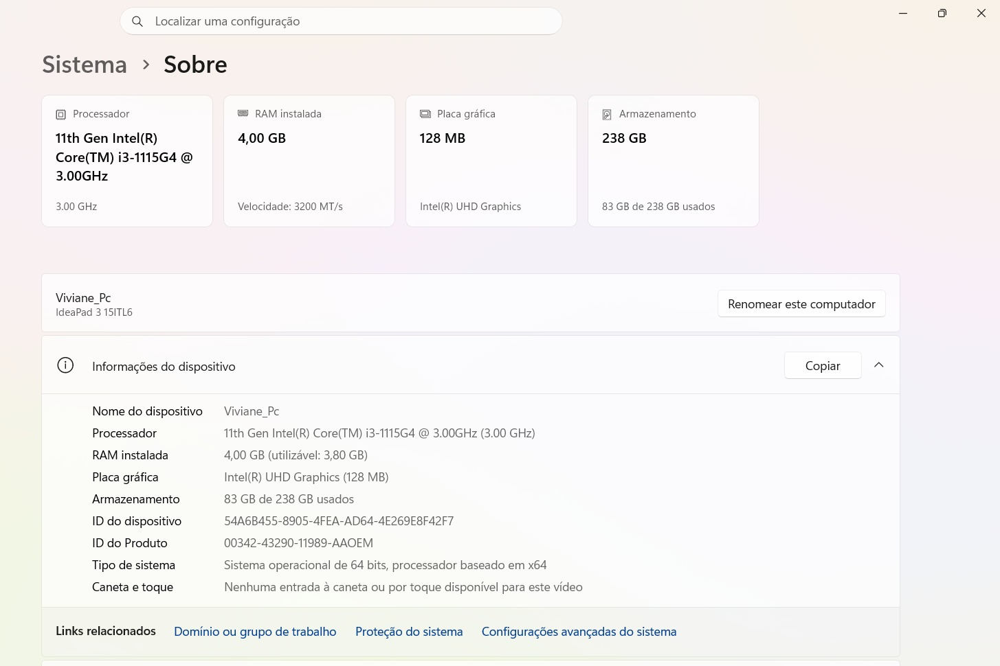

* Foi instalado o executável na pasta do sistema.

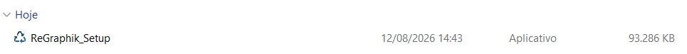

* A linguagem foi escolhida e os termos de uso foram lidos e aceitos.

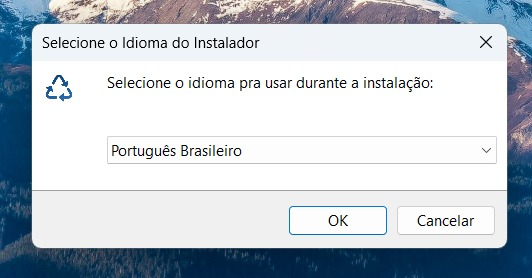

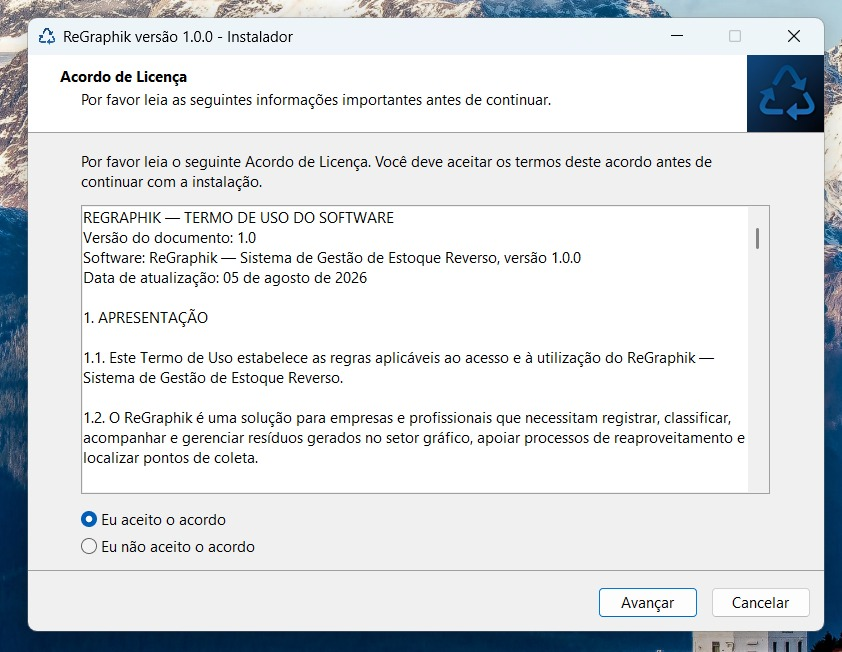

* Assim como o esperado os arquivos foram copiados e enviados para a pasta `Program Files` e foi criado um atalho na tela do usuário.

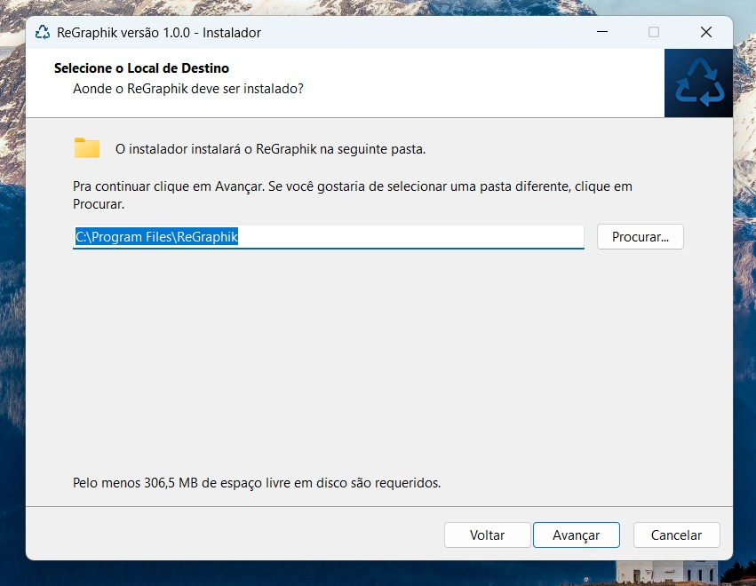


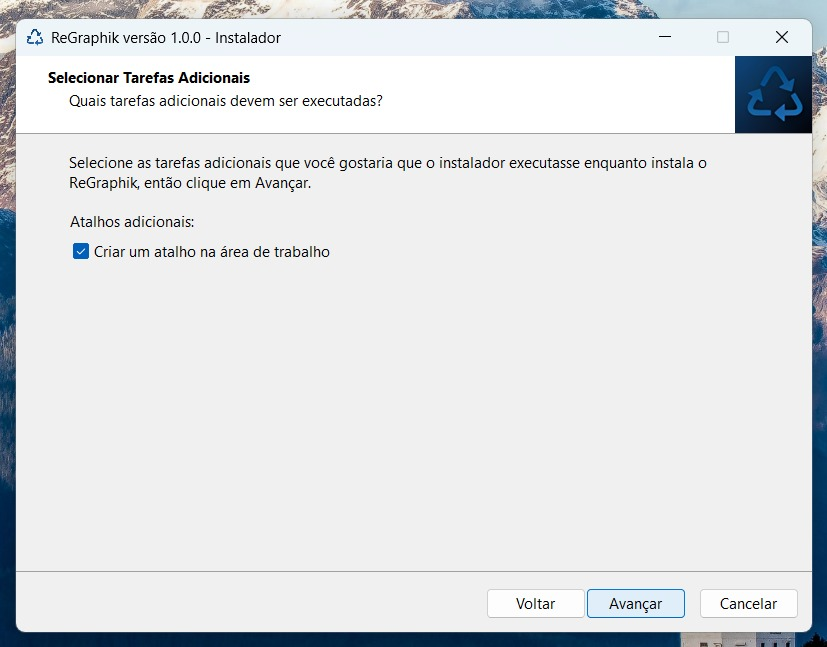

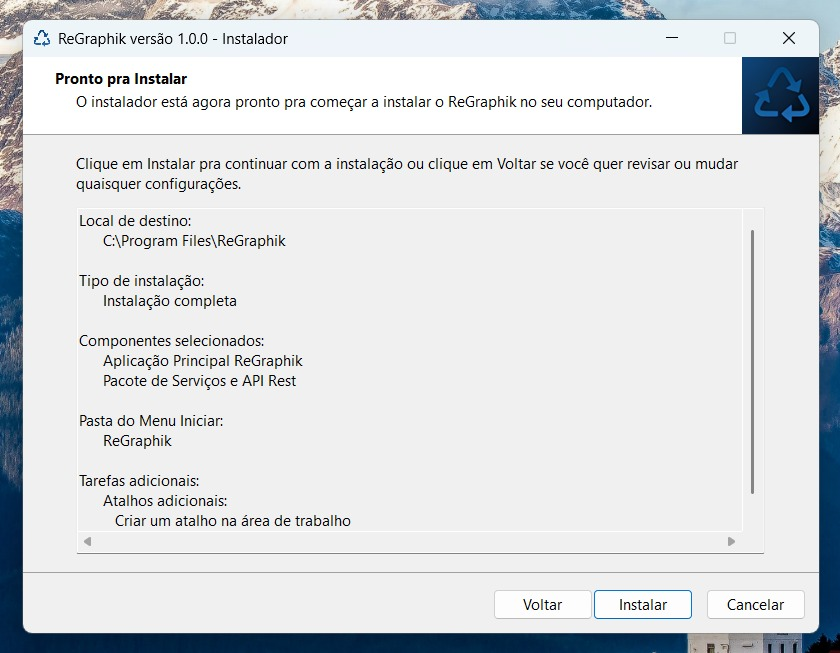

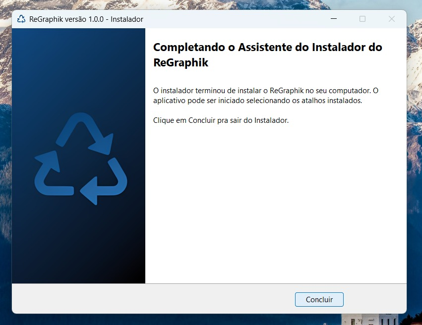


---

<a id="detalhamento-ct046"></a>
#### CT046 - Manutenção / Exigência de Seleção

* Caso uma versão já exista na máquina, o executável fornecerá opção para o aplicativo já baixado.


* Se o usuário tenta avançar sem escolher uma opção, uma mensagem de alerta aparece e ele não consegue prosseguir se uma opção não for escolhida.

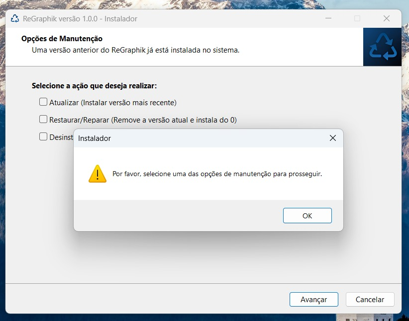

---

<a id="detalhamento-ct047"></a>
#### CT047 - Exclusividade de Seleção (Checkboxes)

* O usuário marca a opção de atualização e logo tenta marcar a opção de desinstalar sem desmarcar a outra antes, o sistema não permite que mais de uma seja marcada então a outra é automaticamente desmarcada.

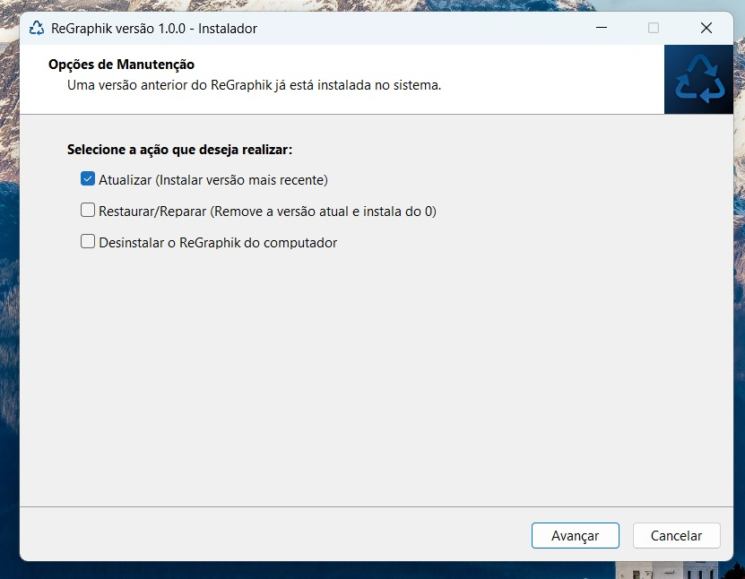

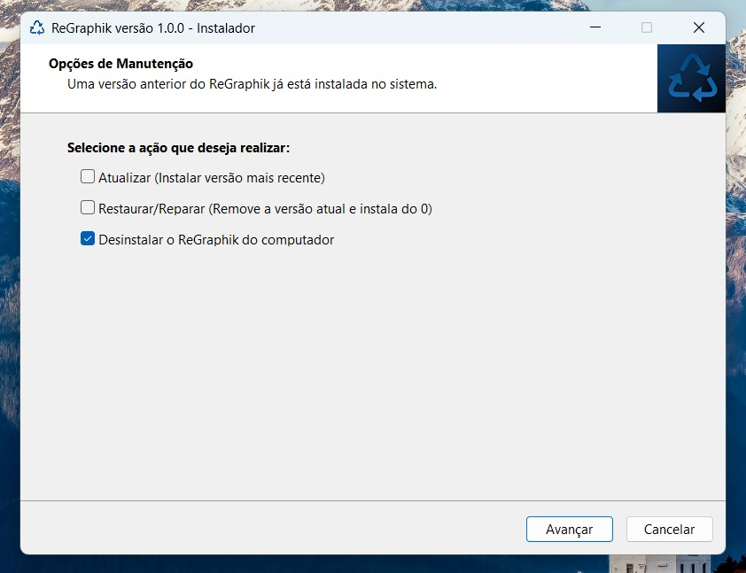

---

<a id="detalhamento-ct048"></a>
#### CT048 - Atualização de Versão

* O usuário escolhe a opção de atualizar, mas como o sistema não possui uma versão superior, ele apenas alerta o usuário sobre isso.

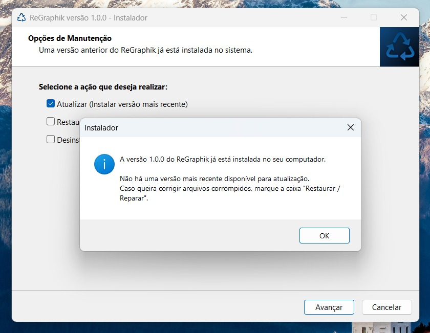

---

<a id="detalhamento-ct049"></a>
#### CT049 - Validação de Aplicação em Execução

* O usuário tenta usar a opção de restaurar o aplicativo quando ele ainda está aberto, e uma mensagem avisando que o sistema está aberto é enviada para que ele aceite fechar o aplicativo aberto antes de restaurar ele.

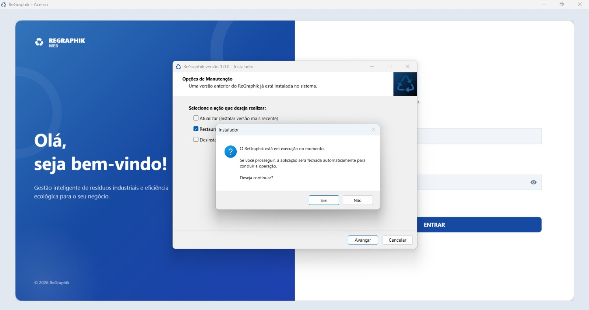

---

<a id="detalhamento-ct050"></a>
#### CT050 - Desinstalação da Aplicação

* O usuário escolhe desinstalar o aplicativo e o instalador desinstala ele com sucesso.


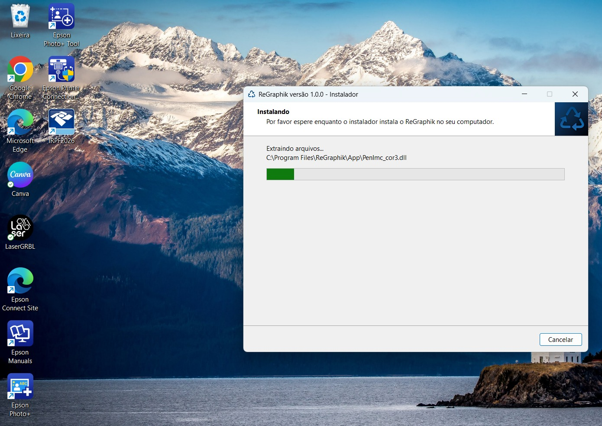

---

### 7.7. Resiliência e Conectividade

| ID | Funcionalidade | Cenário / Condição | Entrada | Resultado Esperado | Resultado Obtido | Evidência do Teste | Status |
| :--- | :--- | :--- | :--- | :--- | :--- | :--- | :--- |
| **CT051** | Tratamento de Rede | Perda de conexão com a Internet durante a navegação no App | Desconectar cabo de rede/Wi-Fi | A interface exibe o status *"Modo Offline / Sem Conexão"* no rodapé e desabilita requisições pendentes sem travar a UI (evita Crash). | — | — | ⏳ Pendente |
| **CT052** | Usabilidade em diferentes resoluções | Verifica se a interface WPF não quebra layout em HD (1366x768) e Full HD (1920x1080) | Rodar o mesmo fluxo (ex: Cadastrar Resíduo) nas duas resoluções | Checar se botões, campos e o WebView2 do mapa continuam visíveis e clicáveis | Teste em conformidade. | [Evidência CT030](#detalhamento-ct030) | ✅ Concluído |

---

#### Detalhamento de Execução dos Testes (Grupo 7.7)

<a id="detalhamento-ct030"></a>
#### CT052 - Usabilidade em Diferentes Resoluções

1. **Funcionalidade:** Usabilidade em diferentes resoluções
2. **Cenário / Condição:** Verifica se a interface WPF não quebra layout em HD (1366x768) e Full HD (1920x1080)
3. **Entrada:** Rodar o mesmo fluxo (ex: Cadastrar Resíduo) nas duas resoluções
4. **Resultado Esperado:** Checar se botões, campos e o WebView2 do mapa continuam visíveis e clicáveis
5. **Resultado Obtido:**


6. **Evidência do Teste:** Teste em conformidade, conforme evidenciado acima no item 5.
7. **Status:** ✅ Concluído

---

## 8. Análise de Riscos

| Risco Identificado | Impacto | Probabilidade | Ação de Mitigação / Prevenção |
| :--- | :---: | :---: | :--- |
| **Inatividade/Warm-up da API (Runasp.net no plano gratuito)** | Médio | Alta | Implementar indicador de carregamento (*Spinner/Loading*) no app WPF e *retry policy* nas chamadas HTTP. |
| **Perda de conexão com o Firebase durante o Chat** | Médio | Média | Tratamento de exceção com notificação na tela (*Toast*) e reconexão automática ao reestabelecer rede. |
| **Falha de renderização do WebView2 (Leaflet.js)** | Alto | Baixa | Adicionar verificação de presença do Runtime do WebView2 no instalador `.msi`/`.exe`. |
| **Estouro de cota de chamadas da Google Places API** | Médio | Baixa | Armazenar em cache no Firebase os resultados de pontos de coleta já pesquisados por cidade. |
| **Entradas de dimensões malformadas no cadastro** | Médio | Alta | Aplicar mascaramento de entrada nos inputs e validação estrita via regex e Análise de Valor Limite. |

---

## 9. Reteste e Regressão

### 9.1 Conceitos e Aplicação no ReGraphik
* **Erro:** Uma falha humana cometida pelo desenvolvedor (ex: esquecer de passar o token JWT no cabeçalho HTTP).
* **Defeito (Bug):** A imperfeição presente na base de código (ex: método de consulta retornando `401 Unauthorized` por falta de header).
* **Falha:** A manifestação visível ao usuário durante o uso (ex: a tela de Estoque Reverso fica em branco e exibe alerta de erro).

* **Processo de Reteste:** Após a correção do defeito pelo desenvolvedor, o testador reexecuta **exatamente o caso de teste que falhou** para confirmar que o problema foi sanado.
* **Processo de Regressão:** Suíte de cenários executados para assegurar que a correção de um módulo (ex: alteração na API) não causou efeitos colaterais indesejados em outros módulos funcionais (ex: Chat ou Relatórios).

### 9.2 Suíte Obrigatória de Testes de Regressão (Top 5 Cenários)
Sempre que houver um novo deploy na API ou nova versão do cliente WPF, as 5 funcionalidades abaixo deverão ser **obrigatoriamente retestadas**:

1. **`CT001` - Autenticação e Renovação de Sessão:** Garantir que o fluxo de login e validação do token permanecem operacionais.
2. **`CT003` - Fluxo de Entrada e Persistência no Estoque Reverso:** Confirmar que o cadastro de resíduos continua gravando corretamente no Firebase.
3. **`CT006` - Integração com Mapa e Geolocalização:** Assegurar que a busca de pontos de coleta via Google Places API / WebView2 continua ativa.
4. **`CT007` - Sincronização do Chat em Tempo Real:** Validar que as mensagens continuam trafegando com baixa latência.
5. **`CT008` - Compilação de Relatórios em PDF:** Garantir que o QuestPDF continua gerando o documento sem erros de layout ou dados zerados.

### 9.3 Critérios de Classificação de Severidade e Prioridade

Para padronizar a triagem de defeitos, a equipe adotará os seguintes critérios objetivos:

**Severidade (impacto técnico no sistema)**

| Nível | Critério no ReGraphik |
| :--- | :--- |
| **Crítica** | Sistema trava, dados são perdidos/corrompidos no Firebase, ou login/API ficam totalmente inacessíveis. |
| **Alta** | Funcionalidade principal (Cadastro, Estoque, ESG) não funciona, mas o sistema não trava. |
| **Média** | Funcionalidade secundária falha (ex: Chat com atraso, Mapa não carrega um pin) mas existe alternativa. |
| **Baixa** | Problemas visuais, de layout ou usabilidade que não impedem o uso (ex: ícone desalinhado). |

**Prioridade (urgência de correção para o negócio)**

| Nível | Critério no ReGraphik |
| :--- | :--- |
| **Alta** | Bloqueia o fluxo principal do operador ou compromete a apresentação/entrega do TCC. |
| **Média** | Afeta a experiência, mas há contorno possível até a próxima versão. |
| **Baixa** | Pode ser corrigido em ciclos futuros sem impacto imediato. |

> Importante: Severidade e Prioridade são avaliadas separadamente. Um defeito de baixa severidade técnica (ex: erro visual na tela de login) pode receber prioridade alta se ocorrer durante a apresentação da banca.

---

## 10. Critérios de Entrada e Saída

### 10.1 Critérios de Entrada (Para iniciar os testes)
* [x] API REST implantada e acessível em `https://webregraphik.runasp.net`.
* [x] Instância do Firebase Realtime Database configurada e online.
* [x] Build da aplicação Desktop WPF e/ou pacote instalador (`.msi` / `.exe`) gerados sem erros.
* [x] Chaves de API (Google Places, Imgur) válidas e configuradas nas variáveis do sistema.

### 10.2 Critérios de Saída (Para aprovar a entrega)
* [x] Execução de no mínimo **95%** dos casos de teste planejados neste documento.
* [x] **100% de aprovação nos Casos de Teste do Escopo Crítico** (Login, Cadastro de Resíduos, API e ESG).
* [x] **Zero defeitos com severidade Alta ou Crítica pendentes de correção**.
* [x] Registro e arquivamento de todas as evidências (prints, logs e PDFs) no repositório.

---

## 11. Evidências e Documentação

### 11.1 Armazenamento de Evidências
Todas as evidências geradas durante os testes deverão ser salvas na pasta do repositório:
`docs/evidencias-testes/`

Formatação esperada das evidências:
* **Capturas de Tela (Prints):** NomeDoTeste_Status.png (Ex: `CT003_CadastroResiduo_SUCESSO.png`).
* **Relatórios Impressos:** Exemplo de PDF exportado com dados de teste.
* **Logs da API/HTTP:** Arquivos `.txt` contendo os retornos do Swagger/Postman.

### 11.2 Padrão de Reporte de Defeito (Bug Report)
Ao encontrar qualquer falha, o testador deverá abrir uma **Issue no GitHub** utilizando o padrão abaixo:

```text
[BUG] - Título claro e objetivo do problema

- Descrição: Explicação sucinta sobre o comportamento incorreto observador.
- Módulo Afetado: [Ex: Cadastrar Resíduos / Chat / API REST / Mapa]
- Passos para Reproduzir:
  1. Abrir o ReGraphik Desktop.
  2. Fazer login com perfil Operador.
  3. Navegar até a aba 'Cadastrar Resíduos'.
  4. Preencher o campo 'Quantidade' com -10 e clicar em 'Salvar'.
- Resultado Esperado: O sistema deve exibir um alerta de validação impedindo o envio.
- Resultado Obtido: O sistema trava (Crash) e lança uma exceção 'FormatException'.
- Severidade: Alta (Trava a aplicação)
- Prioridade: Alta (Bloqueia o fluxo principal do operador)
- Ambiente: Windows 11 64-bits / ReGraphik v1.0.0 / .NET 8.0 Runtime
- Evidência: print_erro_crash.png (em anexo)

````

---

## 12. Recursos Necessários

| Tipo | Recurso |
| :--- | :--- |
| **Equipe** | 5 integrantes atuando em revezamento entre desenvolvimento e testes |
| **Ambiente** | 1 máquina Windows 10/11 64-bits para testes de instalação e execução do WPF |
| **Ferramentas** | Postman/Swagger (API), GitHub Issues (defeitos), WebView2 Runtime |
| **Dados de Teste** | Massa de dados fictícia de resíduos, usuários e conversas no Firebase (ambiente de homologação) |
| **Acessos** | Chaves de API válidas (Google Places, Imgur) configuradas em ambiente de teste |

---

## 13. Cronograma

| Atividade | Período Previsto |
| :--- | :--- |
| Preparação do ambiente e dados de teste | Semana 1 |
| Execução dos Casos de Teste funcionais | Semana 2 |
| Testes de integração (API, Firebase, Google Maps, Imgur) | Semana 2–3 |
| Testes não funcionais e exploratórios | Semana 3 |
| Correção de defeitos, reteste e regressão | Semana 4 |
| Fechamento e relatório final | Semana 5 |

> Este cronograma deverá ser atualizado a cada ciclo de desenvolvimento (sprint) do TCC.


